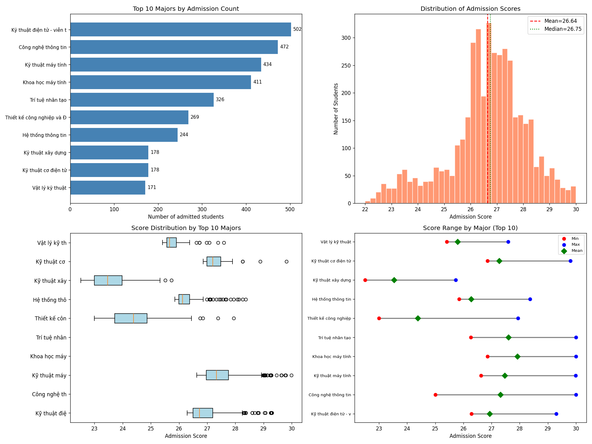

# UET 2026 Admission Analysis Report

## University of Engineering and Technology (UET) — Admitted Student Analysis

---

## 1. Overview

The dataset contains **4,285 admitted students** across **20 majors** offered by the University of Engineering and Technology (UET) for the 2026 academic year. The key fields include student ID, full name, admission score, admission code, and admitted major.

### Overall Admission Score Statistics

| Metric | Value |
|--------|-------|
| Total admitted students | 4,285 |
| Number of majors | 20 |
| Overall mean score | 26.64 |
| Overall median score | 26.75 |
| Standard deviation | 1.48 |
| Minimum score | 22.00 |
| Maximum score | 30.00 |
| 25th percentile | 26.00 |
| 75th percentile | 27.58 |

---

## 2. Student Distribution by Major

The following table shows the number of admitted students per major, sorted by enrollment size:

| Rank | Major | Students | % of Total |
|------|-------|---------|-----------|
| 1 | Electronics & Telecommunications Engineering | 502 | 11.7% |
| 2 | Information Technology | 472 | 11.0% |
| 3 | Computer Engineering | 434 | 10.1% |
| 4 | Computer Science | 411 | 9.6% |
| 5 | Artificial Intelligence | 326 | 7.6% |
| 6 | Industrial Design & Graphics | 269 | 6.3% |
| 7 | Information Systems | 244 | 5.7% |
| 8 | Construction Engineering | 178 | 4.2% |
| 9 | Mechatronics Engineering | 178 | 4.2% |
| 10 | Engineering Physics | 171 | 4.0% |
| 11 | Robot Engineering | 168 | 3.9% |
| 12 | Control & Automation Engineering | 154 | 3.6% |
| 13 | Data Science | 134 | 3.1% |
| 14 | Computer Networks & Data Communication | 134 | 3.1% |
| 15 | Space Engineering | 132 | 3.1% |
| 16 | Materials Engineering | 130 | 3.0% |
| 17 | Mechanical Engineering | 73 | 1.7% |
| 18 | Biotechnology | 71 | 1.7% |
| 19 | Energy Engineering | 70 | 1.6% |
| 20 | Agricultural Technology | 34 | 0.8% |

**Key observations:**
- **Top 5 majors (ICT-related)** account for **50%** of all admitted students.
- **Electronics & Telecommunications Engineering** is the largest major with 502 students (11.7%).
- **Agricultural Technology** has the smallest cohort with 34 students (0.8%).
- The program clearly emphasizes ICT and engineering disciplines over life sciences or agriculture.

---

## 3. Score Analysis by Major

### Most Competitive Majors (Highest Average Score)

| Major | Mean Score | Min | Max | Std Dev |
|-------|-----------|-----|-----|---------|
| **Control & Automation Engineering** | **28.35** | 27.78 | 30.00 | 0.45 |
| **Computer Science** | **27.92** | 26.86 | 30.00 | 0.83 |
| **Artificial Intelligence** | **27.61** | 26.26 | 30.00 | 0.97 |
| **Data Science** | **27.61** | 26.85 | 30.00 | 0.64 |
| **Computer Engineering** | **27.47** | 26.63 | 29.99 | 0.70 |
| **Information Technology** | **27.32** | 25.00 | 30.00 | 1.17 |
| **Mechatronics Engineering** | **27.27** | 26.86 | 29.81 | 0.36 |
| Electronics & Telecom Eng. | 26.93 | 26.29 | 29.30 | 0.60 |
| Computer Networks & Data Com. | 26.56 | 26.00 | 30.00 | 0.71 |
| Mechanical Engineering | 26.43 | 26.13 | 27.29 | 0.24 |

### Least Competitive Majors (Lowest Average Score)

| Major | Mean Score | Min | Max | Std Dev |
|-------|-----------|-----|-----|---------|
| **Agricultural Technology** | **23.04** | 22.00 | 25.10 | 0.89 |
| **Biotechnology** | **23.45** | 22.48 | 26.63 | 0.96 |
| **Construction Engineering** | **23.53** | 22.51 | 25.73 | 0.67 |
| Industrial Design & Graphics | 24.38 | 23.00 | 27.94 | 0.84 |
| Space Engineering | 25.13 | 24.49 | 27.90 | 0.56 |

**Key observations:**
- **5 majors have average scores ≥ 27.0**: Control & Automation, Computer Science, AI, Data Science, and Computer Engineering.
- **Control & Automation Engineering** is the most selective with the highest mean (28.35) and a very tight range (27.78–30.00).
- **Information Technology** has the widest score spread (std=1.17), admitting both top performers and lower-scoring students.
- The three least competitive majors (Agricultural Tech, Biotech, Construction) have means below 24.0.

---

## 4. Score Distribution Analysis

### Overall Distribution
- The overall score distribution is approximately normal, centered around **26.64**.
- There is a noticeable cluster of top scores at **30.00** (perfect score), achieved by 10 students.
- Most students (75%) scored at least **26.00**.
- The interquartile range (IQR) spans from 26.00 to 27.58, indicating relatively high standards overall.

### Top-Performing Students (Score = 30.00)
All 10 students who achieved the maximum score of 30.00 were admitted to either:
- **Information Technology** (6 students)
- **Computer Science** (4 students)

This highlights the fierce competition for the most prestigious computing programs.

### Lowest-Performing Students
The 10 lowest-scoring students (22.00–22.33) were all admitted to **Agricultural Technology**, the least competitive major in terms of admission bar.

---

## 5. Visualization Summary

The generated figure contains four panels:

1. **Top 10 Majors by Admission Count** – Bar chart showing enrollment size per major.
2. **Distribution of Admission Scores** – Histogram of all scores with mean and median markers; shows a roughly normal shape with a slight left skew.
3. **Score Distribution by Top 10 Majors** – Box plots revealing which majors have the highest and most varied score ranges.
4. **Score Range by Major (Top 10)** – Min–max range with mean markers, clearly showing the competitiveness hierarchy.

---

## 6. Admission Code System

The UET uses a standardized admission code system:
- **CN1** → Information Technology
- **CN2** → Computer Engineering
- **CN3** → Engineering Physics
- **CN4** → Mechanical Engineering
- **CN5** → Construction Engineering
- **CN6** → Mechatronics Engineering
- **CN7** → Space Engineering
- **CN8** → Computer Science
- **CN9** → Electronics & Telecommunications Engineering
- **CN10** → Agricultural Technology
- **CN11** → Control & Automation Engineering
- **CN12** → Artificial Intelligence
- **CN13** → Energy Engineering
- **CN14** → Information Systems
- **CN15** → Computer Networks & Data Communication
- **CN17** → Robot Engineering
- **CN18** → Industrial Design & Graphics
- **CN19** → Materials Engineering
- **CN20** → Data Science
- **CN21** → Biotechnology

---

## 7. Key Findings & Conclusions

### A. ICT Dominance
Information and Communication Technology (ICT) fields dominate admissions. The top 5 computing-related majors (IT, Computer Engineering, Computer Science, AI, Electronics & Telecom) account for over **50%** of the entire admitted cohort.

### B. Three Competitive Tiers
Majors form three clear competitiveness tiers based on admission scores:
- **Elite Tier** (mean ≥ 27.5): Control & Automation, Computer Science, AI, Data Science, Computer Engineering
- **Mid Tier** (mean 26.0–27.5): IT, Mechatronics, Electronics & Telecom, Computer Networks, Robot Engineering, Information Systems, Materials Engineering
- **Lower Tier** (mean < 26.0): Engineering Physics, Energy Engineering, Space Engineering, Industrial Design, Construction, Biotech, Agricultural Tech

### C. Score Ceiling Diversity
While some majors (e.g., Control & Automation, Mechatronics) have a very narrow score range indicating high selectivity, others (e.g., Information Technology, AI, Computer Science) accept high-scoring outliers across a wider band.

### D. Emerging Fields Gaining Traction
**Artificial Intelligence** (326 students), **Data Science** (134 students), and **Robot Engineering** (168 students) represent newer, growing fields that already attract substantial student cohorts with competitive entry scores.

---

## 8. Recommendations

1. **Capacity planning**: ICT majors may need additional resources proportional to their 50% enrollment share.
2. **Score standardization**: Consider adjusting admission score weighting to better balance enrollment across all majors.
3. **Growth fields**: AI, Data Science, and Robotics are high-demand programs that may warrant expanded capacity.
4. **Diversity initiatives**: Lower-enrollment programs like Agricultural Technology and Biotechnology could benefit from targeted recruitment.

---

*Report generated from data: Danh_sach_thi_sinh_trung_tuyen_UET_2026.xlsx — 4,285 admitted students, 20 majors.*